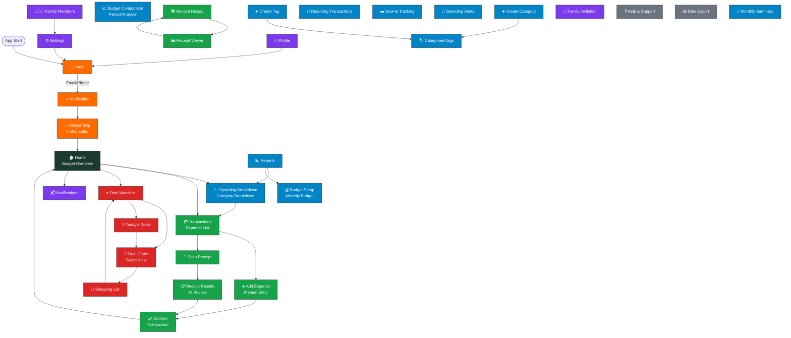

# Budgii UX Flow Map

## Flow Categories

### 🔐 Authentication (Entry Point)
- **Login** → Verification → OnBoarding → Home
- Purpose: User registration & account setup

### 🏠 Hub
- **Home** is the central dashboard
- Distributes to all major features
- Shows budget overview, spending progress

### 💳 Expense Tracking
- **Transactions** (list view) ↔ AddExpense / ScanReceipt
- TransactionConfirm → Home (completion)
- Receipt History for reference

### 📊 Reports & Budget
- **Reports** hub → Budget Setup, Spending Breakdown, Budget Comparison
- Categories/Tags management
- Recurring Transactions & Income Tracking
- Spending Alerts

### 🎁 Deals & Shopping
- **Deal Watchlist** → Deal Cards (swipe) → Shopping List
- Today's Deals report
- Circular navigation

### 👤 User Settings
- **Profile / Settings** → Family setup
- Login option (logout) on Profile & Settings pages
- Notifications hub

### ❓ Support
- Help, Data Export, Monthly Summary
- Standalone pages (no shown navigation)

## Key Insights

1. **Home is the Hub** — Most user journeys start or return here
2. **Two Entry Points**: 
   - New users: Login → Verification → OnBoarding
   - Returning users: Login → Home
3. **Isolated Cycles**:
   - Expense entry: Add/Scan → Confirm → Home
   - Deal browsing: Watchlist ↔ Cards ↔ Shopping List
4. **Hierarchical Settings**: Profile/Settings only navigate to login (logout)
5. **Linear Reports**: Reports → Setup/Breakdown (no return shown, rely on navigation)
