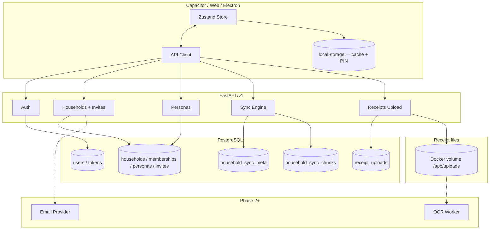

# Budgii API — Backend Roadmap

**Branch:** `feature/fastapi-backend`  
**Stack:** FastAPI · async SQLAlchemy · PostgreSQL · Alembic · Docker Compose  
**API prefix:** `/v1` · **Dev URL:** `http://localhost:8001`

---

## 1. Executive summary

Budgii's backend is a FastAPI service with JWT auth, household tenancy, document-level JSONB sync, **personas** (tag-only family members), **access roles** (admin / editor / viewer with editor levels), and permission-gated sync.

The path forward is three phases: **wire the React app to the API** (Phase 1), **normalize expenses and receipts into relational tables** for reporting and OCR (Phase 2, now in progress), then **production deploy** with managed Postgres, email invites, OAuth polish, and async workers (Phase 3). Receipt images stay on a **local Docker volume** through Phases 1–2; object storage (S3/R2/MinIO) is deferred to Phase 3+ only if scale requires it.

---

## 2. Current state

### Implemented and working

| Area       | Status                     | Endpoints                                                                             |
| ---------- | -------------------------- | ------------------------------------------------------------------------------------- |
| Health     | ✅                         | `GET /v1/health`                                                                      |
| Auth       | ✅                         | Register/login/refresh, OAuth verify endpoints, email verification, password reset     |
| Users      | ✅                         | Profile, avatar, password, active sessions, delete account                             |
| Households | ✅                         | `GET/POST /v1/households`, `POST /v1/households/join`, `POST /v1/households/invites`  |
| Sync       | ✅ (v1)                    | `GET/POST /v1/sync` — document pull/push with revision conflicts                      |
| Expenses   | ✅ (Phase 2)               | `GET/POST/PATCH/DELETE /v1/households/{id}/expenses`                                  |
| Receipts   | ✅ (Phase 2, local volume) | Upload, CRUD, item CRUD, deterministic analyze/status/file endpoints                  |
| Docker     | ✅                         | Postgres + API on `:8001`, Alembic on boot; `receipt_uploads` volume → `/app/uploads` |

### Recent completed work

| Area           | Files                                                     | What changed                                                                  |
| -------------- | --------------------------------------------------------- | ----------------------------------------------------------------------------- |
| Settings panel | `src/pages/Settings.tsx`, settings sub-pages              | Settings flows are linked and backend-aware where applicable                  |
| Receipt OCR    | `app/services/ocr.py`, receipt pages, tests               | OpenAI provider is wired, parser is hardened, and failed analysis is surfaced |
| Dev operations | `scripts/reset_dev_db.sh`, README, roadmap                | Local Docker dev database can be reset and reseeded with one guarded command  |
| Quality gates  | `pyproject.toml`, `scripts/lint.sh`, backend Python files | Ruff lint/format checks are configured and the backend codebase is formatted  |

### Database tables

```
users
refresh_tokens
households
household_personas          ← tag-only members (kids, etc.)
household_memberships       ← access_role, editor_level, persona_id, is_account_holder
household_invites           ← access_role, editor_level, code, expiry
household_sync_meta           ← revision counter + updated_at
household_sync_chunks         ← one JSONB row per config/document sync key
receipt_uploads             ← file metadata (bytes on Docker volume at /app/uploads)
expenses
receipts
receipt_items
notification_read_states
notification_device_tokens
notification_push_deliveries ← idempotent push delivery log
```

### Gaps (not built yet)

| Gap                         | Notes                                                                                                                                                        |
| --------------------------- | ------------------------------------------------------------------------------------------------------------------------------------------------------------ |
| No frontend API client      | **Done** — API client, auth gate, bootstrap, sync, personas, invites, normalized finance                                                                     |
| No invite list/revoke       | **Done** — API-backed pending invite list and revoke UI                                                                                                      |
| No membership admin APIs    | **Done** — role update and removal endpoints plus Family Members UI                                                                                          |
| No email delivery           | **Done** — dev logs invite links; production supports Resend/SendGrid via env                                                                                |
| No real OCR provider        | OpenAI vision provider is wired behind `RECEIPT_OCR_PROVIDER=openai`; receipt failure logging/status visibility is in place; real-receipt QA remains Phase 2 |
| Account settings local-only | **Done** — `PATCH /users/me` updates profile/email and `POST /users/me/password` changes email-account passwords                                             |
| Notifications mock-only     | **Done** — `GET /households/{id}/notifications` generates spending/deal notifications from backend data                                                      |
| Deals/watchlist backend     | **Done** — `POST /households/{id}/deals/check` refreshes synced watchlist/deals and frontend report/cards consume backend-generated deal data                |
| Limited tests               | Auth sessions, bootstrap, household permissions, and normalized finance coverage started in pytest                                                           |
| OAuth deferred              | Apple/Google server verification exists; client UI/wiring and production IDs move to the end                                                                 |

---

## 3. Architecture decisions

### Hybrid relational + JSONB

| Relational (server enforces rules)                         | JSONB sync chunks (bulk sync via merged API) |
| ---------------------------------------------------------- | -------------------------------------------- |
| Users, refresh tokens                                      | Categories, tags, budget, settings           |
| Households, memberships                                    | Income config, goals, alerts                 |
| Personas, invites                                          | Shopping, watchlist, deals                   |
| Receipt upload metadata, expenses, receipts, receipt items | Recurring transactions                       |

**Why hybrid:** The app is one persisted Zustand object today. Document sync ships multi-device backup fast without rewriting 40+ store actions. Normalize expenses/receipts when the server needs SQL (reporting, OCR, search).

**Server-owned (not in sync blob):** `familyMembers` → `/personas`; `familyInvites` → invite endpoints; `expenses`, `receipts`, and `receiptItems` → normalized finance endpoints.

### Permissions

Enforced at the API layer via `services/permissions.py`:

| Role              | Pull sync | Push sync keys                       | Admin actions              |
| ----------------- | --------- | ------------------------------------ | -------------------------- |
| Admin             | All       | All document-sync keys               | Members, invites, personas |
| Editor · full     | All       | All document-sync keys               | —                          |
| Editor · standard | All       | lists, income, recurring             | —                          |
| Editor · limited  | All       | ❌ none; expenses use normalized API | —                          |
| Viewer            | All       | ❌ blocked                           | —                          |

Invites cannot grant `admin`. Household creator gets `admin` + `is_account_holder=True`.

### Sync strategy (Phase 1)

```
Pull:  GET /sync?household_id=&since=  → { snapshot, revision, server_time }
Push:  POST /sync { household_id, changes, base_revision }
       → merge permitted keys only; bump revision; return conflicts[]
```

Storage is split into `household_sync_meta` (revision + `updated_at`) and `household_sync_chunks` (one row per Zustand key from `SYNC_KEYS`). Pull merges all chunks into the same `snapshot` dict the client already expects; push writes only the changed keys' chunks. The API contract is unchanged — no frontend migration needed.

- Revision mismatch → reject push, return conflicting keys
- Client debounces pushes per changed key
- Personas fetched separately via `GET /personas`

### Auth

- JWT access token (60 min) + rotating refresh token (30 days)
- Email/password, email verification, password reset, and Apple/Google OAuth (token verification implemented; needs client IDs)
- In-process auth endpoint rate limiting via `AUTH_RATE_LIMIT_*` env vars
- Capacitor: store refresh token in secure storage; refresh on 401
- Deep link `https://budgii.app/join?code=` → auth → `POST /households/join`

### Storage

| Asset          | Phase 1–2 (current)                | Phase 3+ (optional)                                               |
| -------------- | ---------------------------------- | ----------------------------------------------------------------- |
| Receipt images | Local filesystem via Docker volume | S3/R2/MinIO only if scale requires it                             |
| Postgres       | Docker volume                      | Managed (Neon / RDS)                                              |
| Secrets        | `.env`                             | JWT, OAuth IDs, email API key (+ object-storage creds if adopted) |

#### Receipt storage (chosen approach)

Receipt uploads use **local filesystem storage** — no S3 for now.

| Setting        | Value                                                                                                         |
| -------------- | ------------------------------------------------------------------------------------------------------------- |
| Config         | `RECEIPT_STORAGE_PATH=/app/uploads` (default in `app/config.py`; set in `.env.example`)                       |
| Docker Compose | Named volume `receipt_uploads` mounted at `/app/uploads` on the `api` service                                 |
| Upload layout  | `{RECEIPT_STORAGE_PATH}/{household_id}/{upload_id}_{filename}`                                                |
| API response   | `ReceiptUploadResponse` returns `id`, `status`, `filename` — client stores `id`; file path is server-internal |
| Serving files  | ✅ `GET /receipts/{id}/file` with auth + household check                                                      |

`POST /v1/receipts/upload` writes bytes to disk and records metadata in `receipt_uploads`. Phase 2 OCR workers read from the same local path.

#### Receipt storage options

| Option                    | Fit                                           | Notes                                                                                                          |
| ------------------------- | --------------------------------------------- | -------------------------------------------------------------------------------------------------------------- |
| **Local volume (chosen)** | Dev, Docker Compose, small single-host deploy | Simple; `receipt_uploads` volume persists across container restarts; not ideal for multi-replica or serverless |
| **MinIO**                 | Self-hosted S3-compatible                     | Drop-in S3 API without AWS; easy migration path if you outgrow local disk                                      |
| **S3 / Cloudflare R2**    | Production scale, CDN, multi-region           | Defer until traffic, redundancy, or presigned direct-upload URLs justify the complexity                        |

---

## 4. Phased roadmap

### Phase 1 — Wire frontend to API

**Goal:** Real accounts, cloud sync, personas and invites from server. `localStorage` becomes a cache.

#### Backend tasks

| #   | Task                             | API                                                                                            |
| --- | -------------------------------- | ---------------------------------------------------------------------------------------------- |
| 1   | Commit persona/permissions slice | _(see §6)_                                                                                     |
| 2   | Invite list + revoke             | ✅ `GET /households/invites?household_id=`, `DELETE /households/invites/{id}`                  |
| 3   | Membership admin                 | ✅ `GET /households/{id}/members`, `PATCH`, `DELETE`                                           |
| 4   | Bootstrap                        | ✅ `GET /households/{id}/bootstrap` → household + members + personas + invites + sync snapshot |
| 5   | Viewer pull filtering (optional) | Strip admin-only keys from snapshot for limited roles                                          |

#### Frontend tasks

| #   | Task                                                           | Status                            |
| --- | -------------------------------------------------------------- | --------------------------------- |
| 1   | `src/api/client.ts` — base URL, Bearer, refresh on 401         | ✅                                |
| 2   | `src/api/auth.ts`, `households.ts`, `sync.ts`, `personas.ts`   | ✅                                |
| 3   | Auth gate on login/register screens                            | ✅                                |
| 4   | Map `PersonaResponse[]` → `familyMembers` on hydrate           | ✅                                |
| 5   | Sync middleware: debounced push after mutations; periodic pull | ✅                                |
| 6   | Replace local invite/join with API                             | ✅ (when `VITE_API_ENABLED=true`) |
| 7   | `VITE_API_ENABLED` flag for offline dev fallback               | ✅                                |
| 8   | Membership admin UI                                            | ✅                                |

**Remaining Phase 1 frontend:** Complete enough to move into Phase 2. OAuth (Apple/Google) is intentionally deferred to the end.

#### Phase 1 API surface (complete target)

```
GET  /v1/health

POST /v1/auth/register | /email | /google | /apple | /refresh
GET  /v1/users/me
DELETE /v1/users/me

GET  /v1/households
POST /v1/households
POST /v1/households/join
POST /v1/households/invites
GET  /v1/households/invites?household_id=          ✅
DELETE /v1/households/invites/{id}                 ✅
GET  /v1/households/{id}/members                   ✅
PATCH /v1/households/{id}/members/{user_id}        ✅
DELETE /v1/households/{id}/members/{user_id}       ✅
GET  /v1/households/{id}/bootstrap                 ✅

GET  /v1/personas?household_id=
POST /v1/personas?household_id=
PATCH /v1/personas/{id}?household_id=
DELETE /v1/personas/{id}?household_id=

GET  /v1/sync?household_id=&since=
POST /v1/sync

POST /v1/receipts/upload
```

**ID strategy:** New entities use `crypto.randomUUID()` client-side. Existing `localStorage` data is treated as a local cache/fallback; new API accounts start fresh unless we intentionally add an import flow later.

---

### Phase 2 — Normalize expenses & receipts

**Goal:** SQL-queryable transactions, OCR pipeline, server-side scheduling.

#### New tables

```sql
expenses (id, household_id, persona_id, category_id, amount, date, merchant, …)      ✅
receipts (id, household_id, upload_id, merchant, total, status, image_url, …)        ✅
receipt_items (id, receipt_id, name, amount, category_id, persona_id, …)             ✅
```

#### API additions

```
GET/POST/PATCH/DELETE /households/{id}/expenses?page=&since=       ✅
GET/POST/PATCH/DELETE /households/{id}/receipts                    ✅
GET/POST/PATCH/DELETE /households/{id}/receipts/{id}/items         ✅
POST /receipts/{id}/analyze          → queues async deterministic analyzer ✅
GET  /receipts/{id}/status                                      ✅
GET  /receipts/{id}/file                                        ✅
```

**JSONB shrinks to:** categories, tags, budget, settings, income config, goals, alerts, shopping/watchlist/deals. Expenses, receipts, and receipt items are server-owned via normalized APIs.

**Sync evolution:** Config via document sync; expenses/receipts via paginated API + local cache.

**Remaining Phase 2:** test OpenAI receipt recognition with more real receipts. OCR reads receipt files from `RECEIPT_STORAGE_PATH` (local volume) — no object storage required at this phase.

**Receipt QA hardening done:** failed analysis now stores `analysis_error`, status responses return it, backend logs include receipt/user/household context, and the scan flow surfaces the failure reason instead of a generic error.

**Receipt retry/parser hardening done:** Receipt Results can re-analyze existing uploads, Scan Receipt and Receipt Results share the same API polling/hydration flow, and OpenAI payload parsing now skips total/tax/payment rows, merges duplicate item lines, tolerates numeric strings, and fails clearly when no line items are returned.

**Recurring application done:** `POST /households/{id}/recurring/apply` reads the synced recurring config, creates deterministic normalized expenses for due daily/weekly/biweekly/monthly/quarterly/yearly schedules, skips duplicates, and the frontend runs it during API hydration. `scripts/apply_recurring.py`, `app/workers/recurring.py`, and the Docker Compose `recurring-worker` service provide scheduled execution.

**Spending alert evaluation done:** `POST /households/{id}/spending-alerts/evaluate` reads synced alert config and budget allocations, compares against normalized monthly expenses, and returns active alert results for Home and Spending Alerts.

**Push dispatch worker done:** `scripts/dispatch_push_notifications.py` and the Docker Compose `push-worker` service scan eligible backend-generated notifications, respect master/type notification preferences and quiet hours, send through the configured push provider, and record `notification_push_deliveries` so repeated scheduler runs do not resend the same notification to the same device. The current production-safe provider is `log`; APNs/FCM and native token capture remain Phase 3 provider work.

**Finance pagination UX done:** Transactions and Receipt History render cached finance data in visible pages with load-more controls and result counts, so large local/API-hydrated histories remain manageable on the phone viewport.

---

### Phase 3 — Production deploy

| Component       | Recommendation                                                                                                                                                                                 |
| --------------- | ---------------------------------------------------------------------------------------------------------------------------------------------------------------------------------------------- |
| API hosting     | Fly.io / Railway / ECS (Dockerfile ready)                                                                                                                                                      |
| Database        | Managed Postgres                                                                                                                                                                               |
| Receipt storage | **Keep local volume** on single-host deploy; mount persistent disk on the API container. Move to MinIO or S3/R2 only if you need multi-replica APIs, CDN delivery, or presigned direct uploads |
| Email invites   | ✅ Resend / SendGrid-ready provider (`INVITE_EMAIL_PROVIDER`, `INVITE_EMAIL_FROM`, `INVITE_EMAIL_API_KEY`)                                                                                     |
| OCR             | Async worker reading from `RECEIPT_STORAGE_PATH` (same volume mount as API, or shared NFS if split)                                                                                            |
| Schedulers      | ✅ Compose `recurring-worker` and `push-worker` services using the API image and configurable intervals; runs persist to `background_job_runs` for admin status UX                              |
| Monitoring      | ✅ `/v1/health`, request IDs, and structured request logs; Sentry remains optional at deploy                                                                                                   |
| Mobile          | Capacitor → `https://api.budgii.app/v1`                                                                                                                                                        |
| Universal links | `https://budgii.app/join?code=` → app or web                                                                                                                                                   |
| CORS            | ✅ `CORS_ORIGINS` locks origins when `APP_DEBUG=false`; production startup rejects weak/default JWT secrets                                                                                    |

---

## 5. Frontend integration checklist

### Must sync (JSONB keys)

- [x] `categories`, `tags`
- [x] `budget`, `settings`, `incomeSources`, `incomeItems`, `ongoingIncomes`
- [x] `budgetGoals`, `recurringTransactions`, `spendingAlerts`
- [x] `watchlistItems`, `deals`, `shoppingList`

### Server-owned (API, not blob)

- [x] `familyMembers` → `GET /personas` mapped to store shape
- [x] `familyInvites` → invite endpoints (create, list, revoke)
- [x] `userProfile.name/email/avatar` → `GET /users/me`
- [x] `expenses`, `receipts`, `receiptItems` → normalized finance endpoints

### Stay local (never sync)

- [x] `appLock` (PIN hash/salt)
- [x] `userProfile.preferences.theme`
- [x] QA annotations

### Auth flow

- [x] Login/register → store tokens
- [x] Capacitor secure token storage
- [x] Logout in Account Settings clears auth state and stored tokens
- [x] Email verification and password reset use single-use hashed action tokens
- [x] Active sessions list/revoke maps to rotating refresh tokens
- [x] Create or join household on first use
- [x] Pull sync snapshot → hydrate Zustand
- [x] Push on mutation with `base_revision`
- [x] On conflict: re-pull and merge (per-key LWW for v1)

### Persona ↔ FamilyMember mapping

| Frontend `FamilyMember`                                 | Backend source                 |
| ------------------------------------------------------- | ------------------------------ |
| `id`                                                    | `persona.id`                   |
| `name`, `relationship`, `avatar`, `active`, `isDefault` | `PersonaResponse` fields       |
| `isAccountHolder`                                       | `membership.is_account_holder` |
| `hasAppAccess`                                          | persona has linked membership  |
| `accessRole`, `editorLevel`                             | membership fields (if linked)  |

---

## 6. What to commit first

**Commit 1 — backend foundation** (before any frontend work):

```
budgii-api/app/models/access.py
budgii-api/app/models/__init__.py
budgii-api/app/schemas/access.py
budgii-api/app/schemas/persona.py
budgii-api/app/schemas/household.py
budgii-api/app/services/permissions.py
budgii-api/app/services/persona.py
budgii-api/app/services/household.py
budgii-api/app/services/sync.py
budgii-api/app/services/seed.py
budgii-api/app/api/personas.py
budgii-api/app/api/households.py
budgii-api/app/api/receipts.py
budgii-api/app/api/router.py
budgii-api/alembic/versions/001_initial.py
budgii-api/alembic/env.py
```

Suggested message: _Add household personas, access roles, and permission-gated sync._

Do **not** mix unrelated frontend changes (`ProgressRing.tsx`, `Home.tsx`, etc.) into this commit.

**Commit 2:** Invite list/revoke + membership admin endpoints ✅

**Commit 3:** Frontend API client + auth + sync layer ✅

---

## 7. Open questions

| #   | Question                                        | Options / notes                                                                                     |
| --- | ----------------------------------------------- | --------------------------------------------------------------------------------------------------- |
| 1   | Single vs multi-household in v1 UI?             | API supports multiple; frontend assumes one                                                         |
| 2   | Migrate existing `localStorage` on first login? | Resolved for pre-market: fresh start; import flow can be added later if needed                      |
| 3   | Client-generated UUIDs vs server-assigned IDs?  | UUIDs client-side recommended for offline-first                                                     |
| 4   | Single-use invite codes vs reusable links?      | Current: single-use, 7-day expiry                                                                   |
| 5   | Viewer data scope                               | Resolved: full household read; writes/admin actions remain blocked                                  |
| 6   | Account holder transfer                         | Permanent owner vs transferable admin                                                               |
| 7   | Add member + invite in one API call?            | Matches `FamilyMembers.tsx` save flow                                                               |
| 8   | Phone/SMS invites?                              | Resolved for v1: email-only; Twilio can be added later                                              |
| 9   | OCR provider                                    | Resolved for Phase 2: OpenAI vision with deterministic fallback for tests/dev                       |
| 10  | Electron vs mobile backend                      | Resolved: web/Electron/mobile share the API when `VITE_API_ENABLED=true`                            |
| 11  | Deals/watchlist backend                         | Resolved for Phase 2: backend-generated deterministic deal checks; real retailer integrations later |
| 12  | Conflict resolution                             | Per-key LWW (v1) vs per-entity merge                                                                |

---

## 8. Architecture diagram



---

## Run locally

```bash
cp budgii-api/.env.example budgii-api/.env
docker compose -f docker-compose.dev.yml up --build
# API: http://localhost:8001/docs
# Receipt files persist in Docker volume `receipt_uploads` → /app/uploads
```

If host port `5432` is already used by another local Postgres, use the dev override.
It keeps Budgii Postgres internal to Docker while still exposing the API on `:8001`,
and auto-seeds the default dev login if it is missing.

```bash
docker compose -f docker-compose.dev.yml up --build
```

For a staging deployment-style run, use the staging compose file. It exposes the
frontend on the less common `:18088`, the API on `:18087`, and keeps Postgres
private on the Docker network:

```bash
budgii-api/scripts/create_server_env.sh
docker compose --env-file .env.server -f docker-compose.staging.yml up --build -d
```

Leave `INVITE_EMAIL_PROVIDER=log` until a real `INVITE_EMAIL_API_KEY` is set.

Compose stack names are fixed in the files so each environment is isolated:
`budgii-dev`, `budgii-staging`, and `budgii-production`. The root server compose is
the production stack and defaults to `:28088` frontend / `:28087` API, separate from
staging.

```bash
cp budgii-api/.env.production.example .env.production.server
docker compose --env-file .env.production.server -f docker-compose.production.yml up --build -d
```

To wipe the local Docker dev database, re-run Alembic migrations, and load the
rich mock dataset:

```bash
budgii-api/scripts/reset_dev_db.sh --yes
```

The reset script intentionally leaves receipt upload files in the Docker volume.
It only recreates the Postgres schema and rows.

---

_MJ Productions — dev@mjproductions.app_
